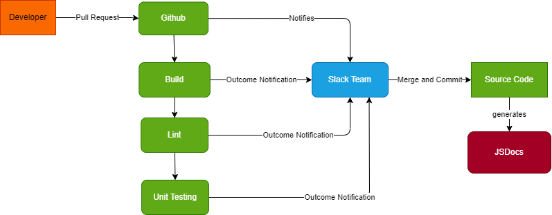

# Pipeline Status
## Diagram

## Completed Implementations
Currently, the list of functional portions of our pipeline are as follows
- Pull requests
- Automated unit testing
- Outcome notifications of all pull requests
- Team approval for merging/committing to source
- Fully fleshed out front-end unit tests (right now only sanity check implemented) 
- Automated linting/build check
- Auto-generated JSDocs
- Auto deploy to Netlify and Github Pages

## Planned
- Staging and deployment steps
  - Build/Staging environment
  - Integrated testing
