# **Team Sleep Deprived Group Page** :zzz:

  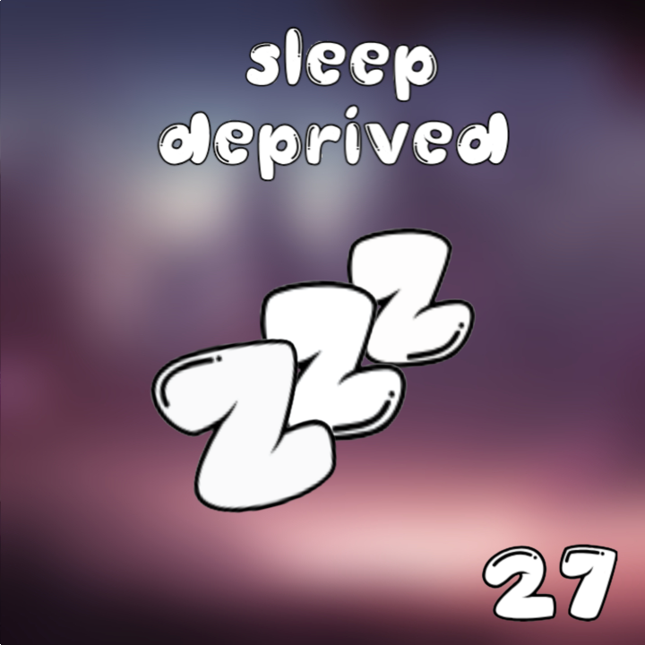

Welcome to the **Team Sleep Deprived** Group Page! Here at **Team Sleep Deprived**, we believe in creating quality software that won't keep you up all night. Our developers work endlessly to ruin their sleep schedules so you don't have to ruin your own! Below you will find a brief description of our team brand and values as well as a short bit of information about each teammate.
 

## <ins>**Team Brand**</ins>
Our team is currently still in the process of figuring the complete picture of our brand, but we do have some characteristic designs. Our team logo is done and we plan to decorate our software with colors that remind people of the sleep and the night. I (Jake) also like the idea of using cats as a sort of brand mascot :smiley_cat:
 

## <ins>**Team Values and Mission**</ins>

Here at **Team Sleep Deprived**, we strive to make clean and effective software that helps make life easier.  In software, we value simplicity, effectiveness, and ingenuity. Within our team, we value strong communication, psychological safety, and fun. Our mission this quarter is to create an information management CRUD app. Hopefully our app can prove to be an effective and good piece of software.

## <ins>**Meet the Team**</ins>

### **Anthony Chen** - [Github](https://github.com/achen200)

  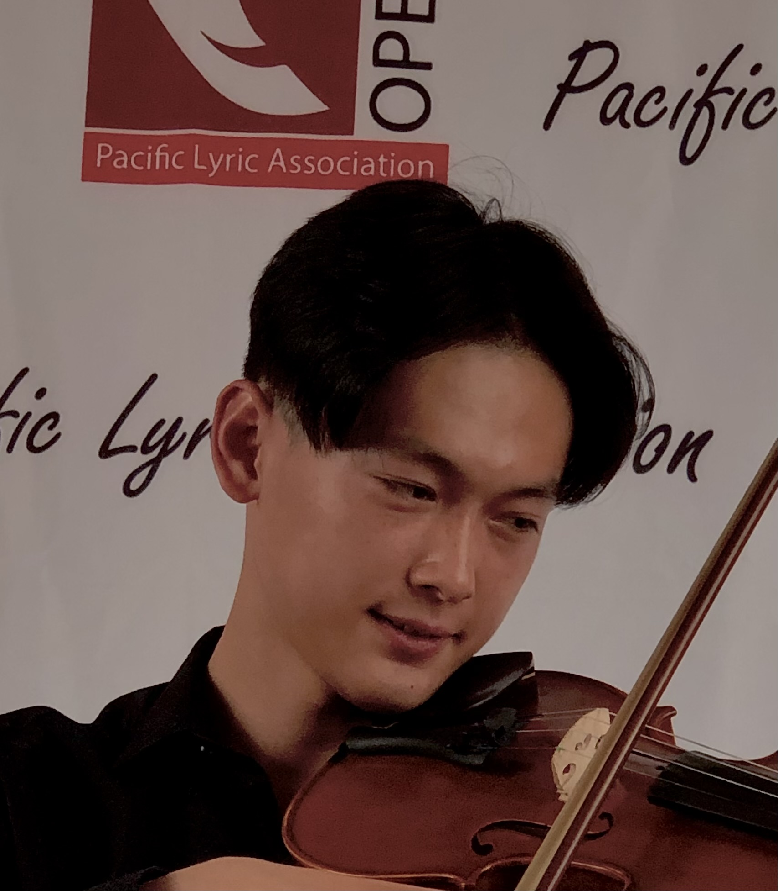 

Hi my name is Anthony and I'm a third year computer science student who enjoys playing soccer, volleyball, and violin. I dislike middles in volleyball, left-backs in soccer, and violists in orchestra despite having been all three in the past myself.
  

### **Michael Phung** - [Github](https://github.com/klm4life)

  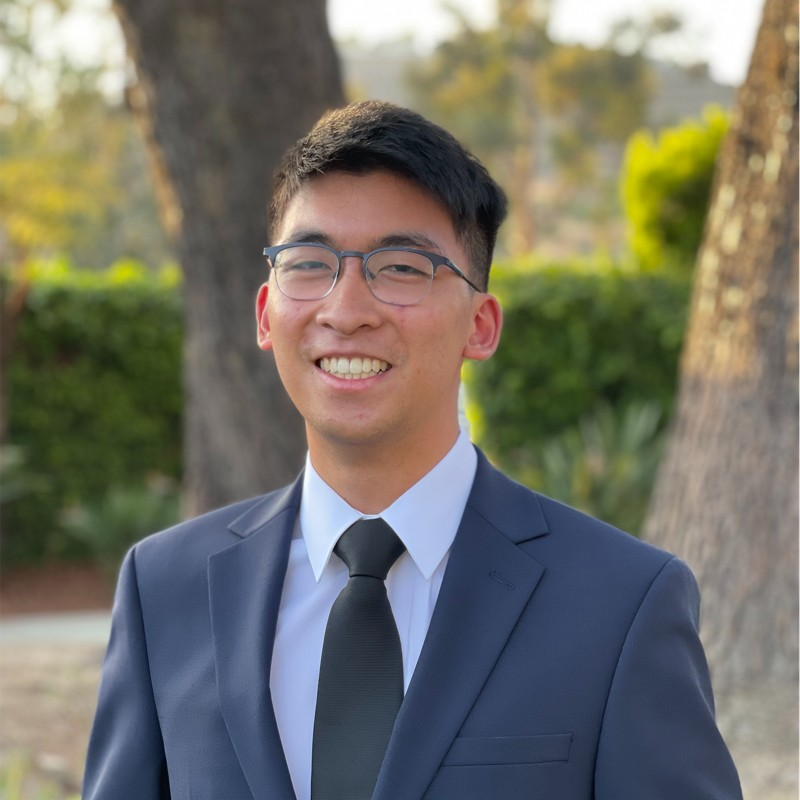 

Hello. My name is Michael Phung and I am a 4th year student studying Mathematics - Computer Science. My main hobbies include games, volleyball, and chess. An interesting fact about me is that I am left-handed but I write with my right hand.
  

### **Andrew Lu** - [Github](https://github.com/landrewu)

  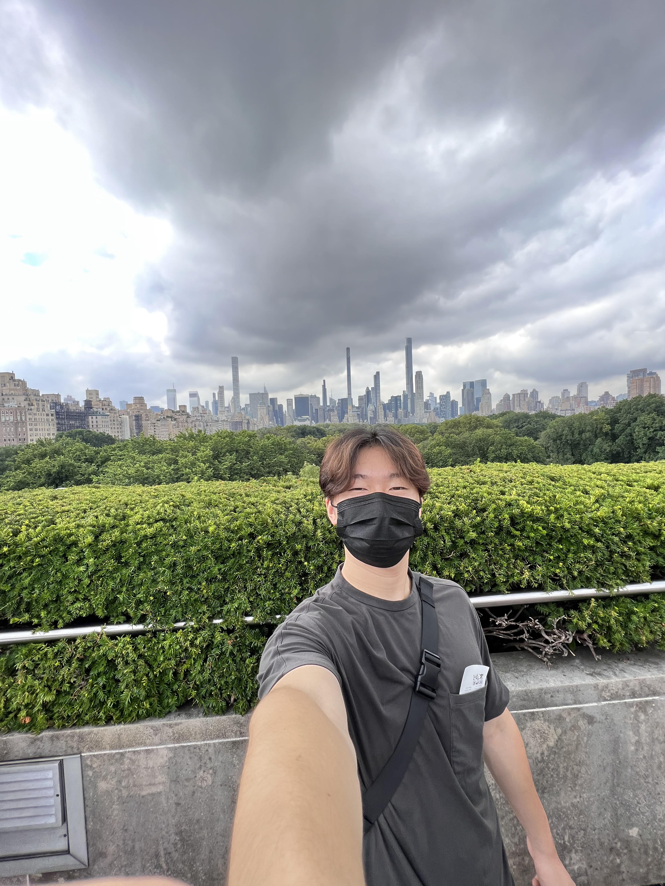 

I'm Andrew Lu, a third year Computer Engineering Major in ERC born and raised in SoCal. My favorite hobbies, by far, are eating and sleeping. Looking forward to becoming a better software engineer this quarter.
  

### **Andrew Nguyen** - [Github](https://github.com/3ndrew123)

  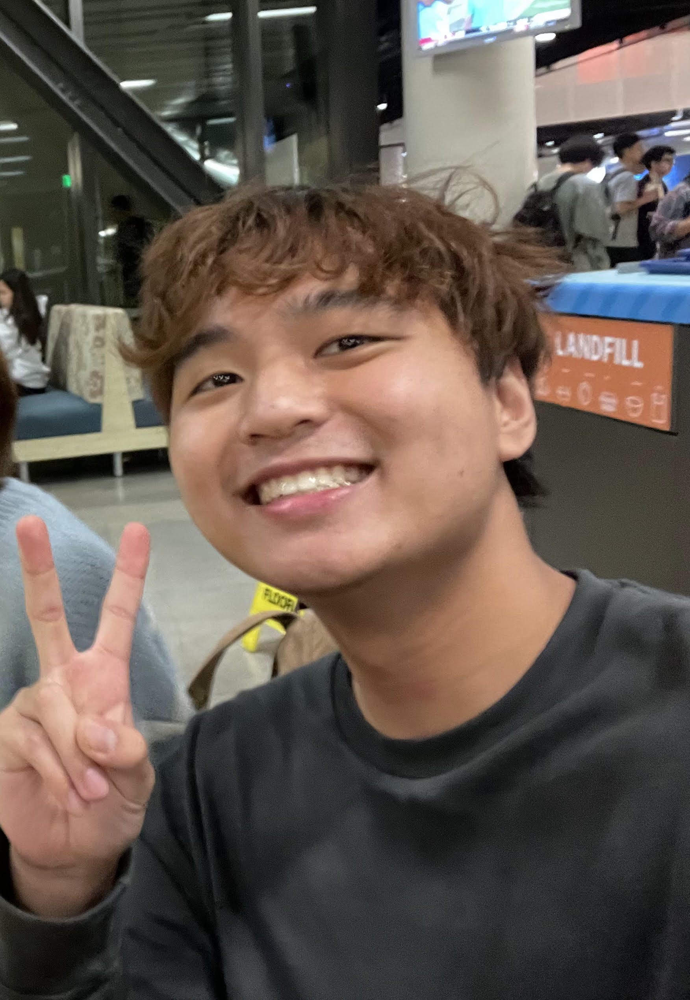 

 

Hello, my name is Andrew Nguyen and I am a 3rd year Computer Science Major from Sixth College! I am in group 27 Team Sleep Deprived and I hope to create a successful and memorable project with my team. Some things I like to do in my free time is swim, build keyboards, and read manga!
  

### **Javier Zuniga** - [Github](https://github.com/j3delacr)

  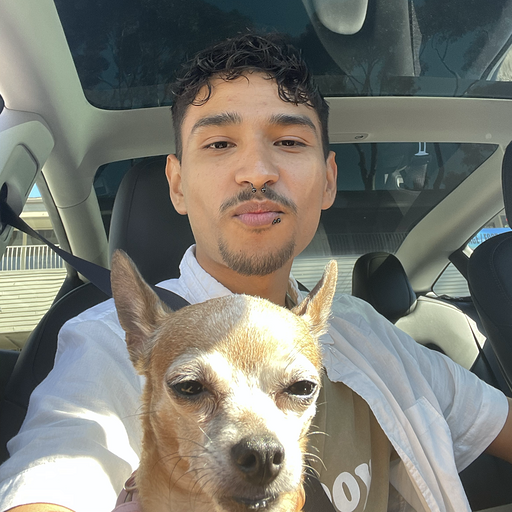 

 

Hello, my name is Javier and I am a Computer Science Major from San Diego/Tijuana! I am interested in the fields of immigration, research, artificial intelligence, game design, and education. My favorite coding language is C++ and I love going to concerts, festivals, raves, and anything music related.
  

### **Kevin Chang** - [Github](https://github.com/kc092444)

  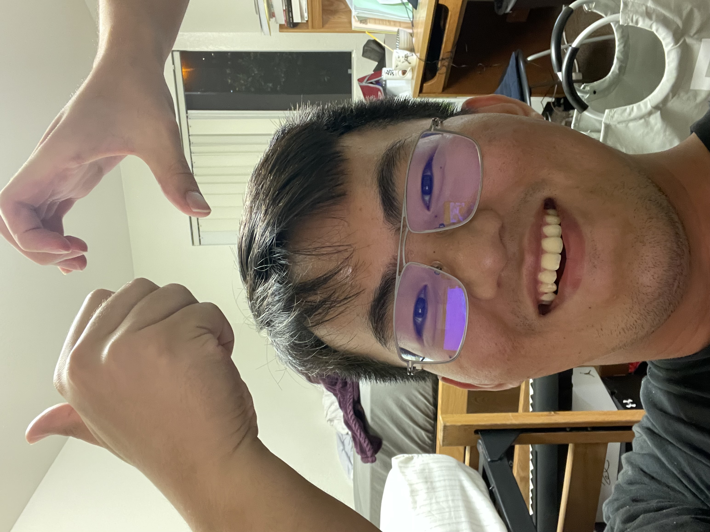 

 

Hi! I am Kevin Chang. I am a senior majoring in Computer Engineering. One of my favorite things is road trips! I enjoy the feeling when driving the car which makes me feel that I am connected to the land (I know It sounds pretty weird haha).
  

### **Shuo Wang** - [Github](https://github.com/Oooleaf)

  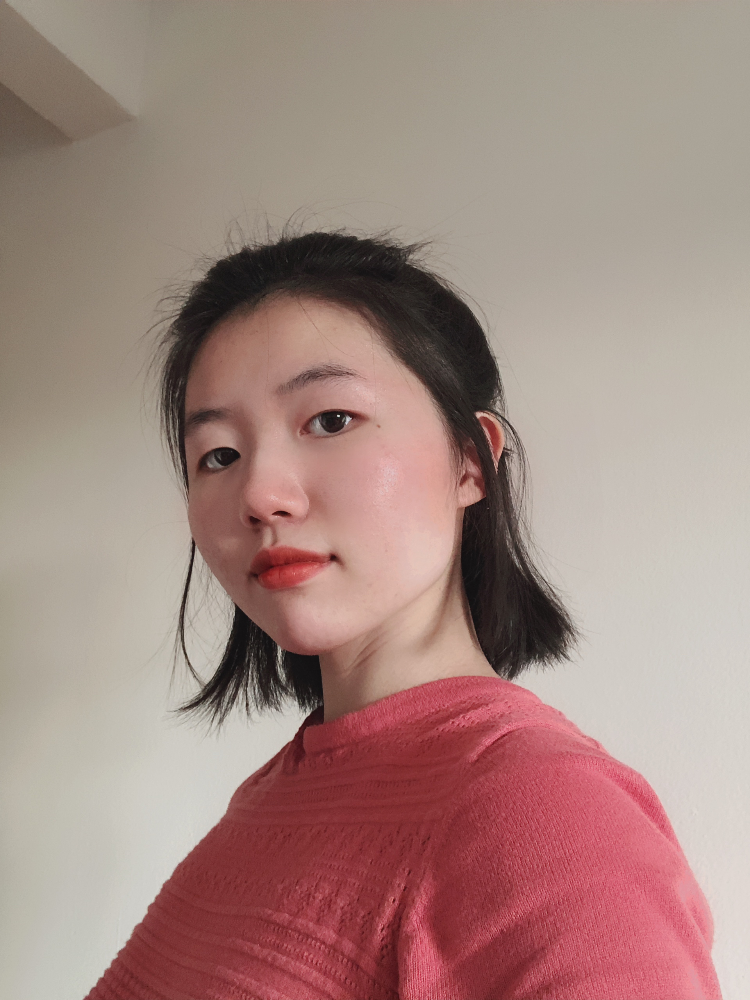 

 

Hi my name is Shuo Wang, a computer science major student at UCSD. I love watercolor and I paint a lot.
  

### **Abigail Koornwinder** - [Github](https://github.com/akoornwinder4)

  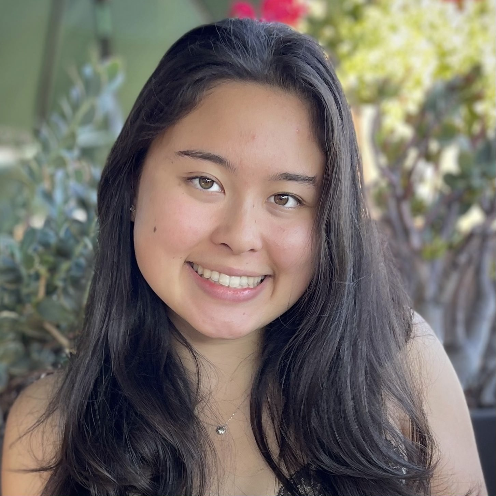 

 

Hi I'm Abigail Koornwinder and I'm a fourth year studying Cognitive Science Machine Learning and Neural Computation, and minoring in Computer Science. I am from Santa Clara, CA and I enjoy swimming and reading by the beach.
  

### **Ashwin Alagiri-Rajan** - [Github](https://github.com/aashwinr)

  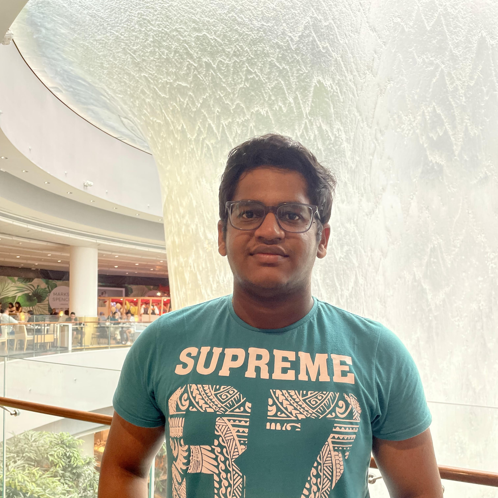 

I’m a Junior Computer Engineering student. I’m an international student from Qatar! I’ll be the team lead for Team Sleep Deprived (Team 27).
  

### **Jacob Graven** - [Github](https://github.com/jacobgraven)

  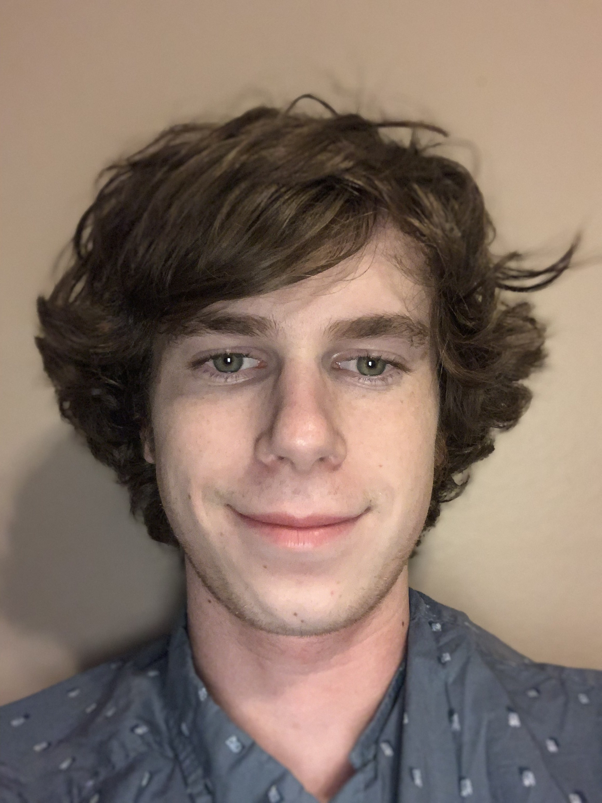 

 

Hello my name is Jacob (Jake) Graven. I was born and raised in San Diego and I am currently a third year computer science major at UCSD. I enjoy rock climbing and I absolutely love cats.
 

